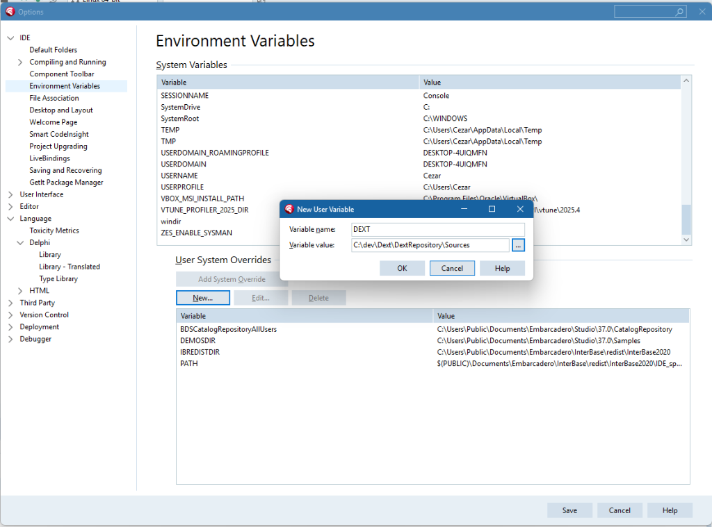

# Dext Framework Installation Guide

This guide covers the installation of the Dext Framework. You can choose between the **Automated Setup** (recommended) or the **Manual Setup**.

## Prerequisites
- Delphi 11 Alexandria or newer.
- Git (to clone the repository).

---

## Installation Steps

### 1. Environment Variable Configuration (Best Practice)


Using an environment variable simplifies your Library Paths and allows you to switch between different versions/forks of Dext easily.

1.  In Delphi, go to **Tools** > **Options** > **IDE** > **Environment Variables**.
2.  Click **New...**
3.  **Variable Name**: `DEXT`
4.  **Value**: The full path to the `Sources` directory inside your cloned repository.
    *   *Example*: `C:\dev\Dext\DextRepository\Sources`
    *   *Note*: Ensure it points to the `Sources` folder, not the root, to match the paths below.
    
    

### 2. Configure Library Paths

Add the following paths to your **Library Path** (Tools > Options > Language > Delphi > Library) for your target platforms (Win32, Win64, Linux64). 

If you set up the `$(DEXT)` variable as described above:

```text
$(DEXT)\..\Output\$(ProductVersion)_$(Platform)_$(Config)
```

### 3. Configure Browsing Path

Add the following paths to your **Browsing Path** (Tools > Options > Language > Delphi > Library) for your target platforms.
This allows the IDE to find the source code for debugging and "Ctrl+Click" navigation.

```text
$(DEXT)
$(DEXT)\Core
$(DEXT)\Core\Base
$(DEXT)\Core\Json
$(DEXT)\Data
$(DEXT)\Hosting
$(DEXT)\Hosting\Cli
$(DEXT)\Hosting\Cli\Commands
$(DEXT)\Web
$(DEXT)\Web\Caching
$(DEXT)\Web\Hosting
$(DEXT)\Web\Indy
$(DEXT)\Web\Middleware
$(DEXT)\Web\MVC
```

### 3. Build

1.  Open `Sources\DextFramework.groupproj`.
2.  Right-click **ProjectGroup** > **Build All**.

---

## Troubleshooting

- **"File not found" during Manual Build**: Ensure all subdirectories in `Sources` are covered by your Library Path or the `$(DEXT)` expansion.
