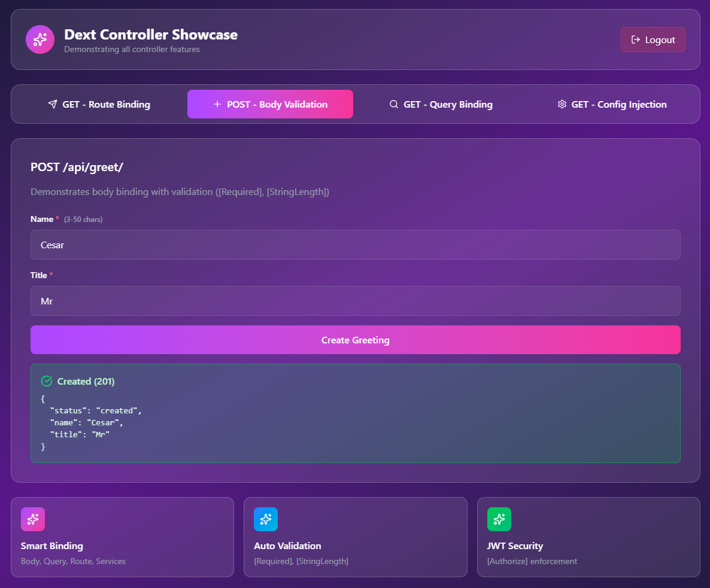

# 🚀 Web.ControllerExample - Showcase Completo de Web API

Demonstração abrangente dos **Controllers do Dext Framework** - um framework web moderno para Delphi inspirado no ASP.NET Core.

Esta pasta contém **dois projetos** demonstrando estilos de configuração diferentes:
1.  **`Web.ControllerExample.dpr`** (Padrão): Configuração declarativa padrão.
2.  **`Web.ControllerExample.FluentAPI.dpr`** (Fluente): Estilo moderno de configuração Fluent API.

Ambos os projetos expõem a **mesma API** e compartilham os mesmos controllers e serviços.



---

## ✨ Funcionalidades Demonstradas

| Funcionalidade | Descrição |
|---------|-------------|
| **Autenticação JWT** | Autenticação Bearer token com atributo `[Authorize]` |
| **Model Binding** | Binding de Rotas, Body, Query e Header |
| **Validação** | `[Required]`, `[StringLength]` com respostas 400 automáticas |
| **Injeção de Dependência** | Injeção via construtor nos controllers |
| **Filtros de Ação** | `[LogAction]`, `[ResponseCache]`, `[RequireHeader]` |
| **Versionamento de API** | Versionamento via Query string e Header |
| **Health Checks** | Endpoint `/health` com verificações de estado |
| **Content Negotiation** | Formatação de resposta baseada no header Accept |
| **CORS** | Suporte a Cross-Origin configurável |
| **Arquivos Estáticos** | Servir SPA e assets |
| **Configuração** | Configurações fortemente tipadas via `appsettings.json` |

---

## 🚀 Quick Start

### 1. Execute o Servidor

Escolha seu estilo de configuração preferido:

**Opção A: Configuração Padrão**
```bash
Web.ControllerExample.exe
```

**Opção B: Configuração Fluent API**
```bash
Web.ControllerExample.FluentAPI.exe
```

O servidor inicia em `http://localhost:8080`.

> **Nota:** A aplicação cria automaticamente um `appsettings.json` padrão se ele não existir.

### 2. Execute a Suite de Testes

Fornecemos uma suite de testes abrangente em PowerShell que valida todos os endpoints:

```powershell
.\Test.Web.ControllerExample.ps1
```

Saída esperada: 
```
TEST SUMMARY
============================================================
  Passed: 25
  Failed: 0
```

### 3. Frontend (WebClient)

Um frontend moderno em React + TypeScript + Vite está incluído para demonstrar o uso no mundo real.

```bash
cd WebClient
npm install
npm run dev
```

Acesse `http://localhost:5173`.
- **Usuário:** `admin`
- **Senha:** `admin`

---

## 🎭 Comparação de Estilos de Configuração

### API Padrão (`Web.ControllerExample.dpr`)

Configuração padrão usa métodos builder com objetos de opções:

```pascal
// CORS
var corsOptions := Builder.CreateCorsOptions;
corsOptions.AllowedOrigins := ['http://localhost:5173'];
Builder.UseCors(corsOptions);

// JWT
var AuthOptions := Builder.CreateJwtOptions('secret-key...');
AuthOptions.Issuer := 'dext-issuer';
Builder.UseJwtAuthentication(AuthOptions);
```

### Fluent API (`Web.ControllerExample.FluentAPI.dpr`)

A Fluent API oferece uma maneira mais concisa e legível de configurar middlewares:

```pascal
// CORS com Fluent API
Builder.UseCors(procedure(Cors: TCorsBuilder)
begin
  Cors.WithOrigins(['http://localhost:5173'])
      .WithMethods(['GET', 'POST', 'PUT', 'DELETE'])
      .AllowAnyHeader
      .AllowCredentials
      .WithMaxAge(3600);
end);

// JWT com Fluent API
Builder.UseJwtAuthentication('secret-key...',
  procedure(Auth: TJwtOptionsBuilder)
  begin
    Auth.WithIssuer('dext-issuer')
        .WithAudience('dext-audience');
  end
);
```

---

## 📋 Referência de Endpoints

### Autenticação
| Método | Endpoint | Descrição |
|--------|----------|-------------|
| POST | `/api/auth/login` | Login (retorna JWT) |

### Greeting Controller (Protegido)
| Método | Endpoint | Descrição |
|--------|----------|-------------|
| GET | `/api/greet/{name}` | Binding de rota |
| GET | `/api/greet/negotiated` | Content negotiation (AllowAnonymous) |
| POST | `/api/greet` | Body binding com validação |
| GET | `/api/greet/search?q=&limit=` | Query binding |
| GET | `/api/greet/config` | Padrão IOptions e Configuração |

### Filters Controller (Demo de Filtros)
| Método | Endpoint | Filtros Aplicados |
|--------|----------|-----------------|
| GET | `/api/filters/simple` | `[LogAction]` |
| GET | `/api/filters/cached` | `[ResponseCache(60)]`, `[AddHeader]` |
| POST | `/api/filters/secure` | `[RequireHeader("X-API-Key")]` |
| GET | `/api/filters/admin` | `[RequireAdminRole]`, `[TimingFilter]` |
| GET | `/api/filters/protected` | `[RequireHeader("Authorization")]` |

### List/Object Controllers
| Método | Endpoint | Descrição |
|--------|----------|-------------|
| GET | `/api/list` | Serialização de IList<TPerson> |
| GET | `/api/object` | Serialização de TPersonWithAddress |
| GET | `/api/object/nested` | Serialização de objeto aninhado |
| GET | `/api/object/list` | Lista de objetos com tratamento de nulos |

### Versionamento de API
| Método | Endpoint | Descrição |
|--------|----------|-------------|
| GET | `/api/versioned?api-version=1.0` | Versionamento via Query string |
| GET | `/api/versioned` + `X-Version: 2.0` | Versionamento via Header |

### Health Checks
| Método | Endpoint | Descrição |
|--------|----------|-------------|
| GET | `/health` | Status de saúde da aplicação |

---

## 🏛️ Arquitetura

```
Web.ControllerExample/
├── Web.ControllerExample.dpr           # Configuração Padrão
├── Web.ControllerExample.FluentAPI.dpr # Configuração Fluente
├── ControllerExample.Setup.pas         # Lógica de setup compartilhada
├── ControllerExample.Controller.pas    # Todos os controllers
├── ControllerExample.Services.pas      # Implementação de serviços e Settings
├── Test.Web.ControllerExample.ps1      # Suite de testes automatizados da API
├── WebClient.png                       # Screenshot
├── README.md                           # Versão em Inglês
├── README.pt-br.md                     # Este arquivo
└── WebClient/                          # Frontend React SPA
```

---

## 💡 Exemplos de Código

### Controller com DI e Injeção de Configuração

```pascal
[DextController('/api/greet')]
TGreetingController = class
private
  FService: IGreetingService;
  FSettings: IOptions<TMySettings>;
public
  // Injeção de Dependência via Construtor
  constructor Create(AService: IGreetingService; Settings: IOptions<TMySettings>);
  
  [DextGet('/config')]
  procedure GetConfig(Ctx: IHttpContext);
end;

procedure TGreetingController.GetConfig(Ctx: IHttpContext);
begin
  // Acesso a configurações fortemente tipadas
  var Msg := FSettings.Value.Message;
  Ctx.Response.Json(Format('{"message": "%s"}', [Msg]));
end;
```

---

## 📦 Pré-requisitos

- Delphi 11+ (Alexandria ou superior)
- Dext Framework no Library Path
- Node.js 18+ (apenas para o WebClient)

---

## 📄 Licença

Este exemplo é parte do Dext Framework e está licenciado sob a Apache License 2.0.

---

*Desenvolvimento Web Moderno para Delphi! 🚀*
